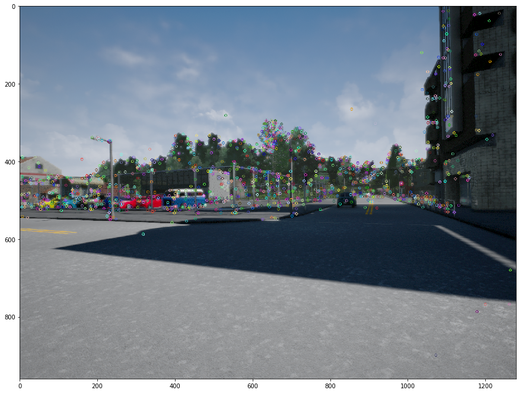
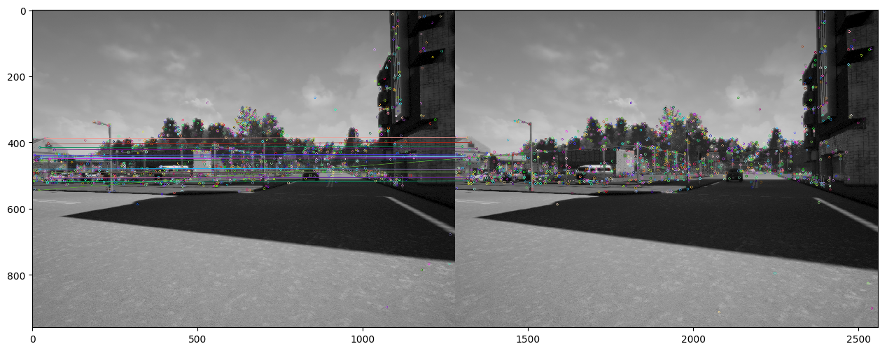
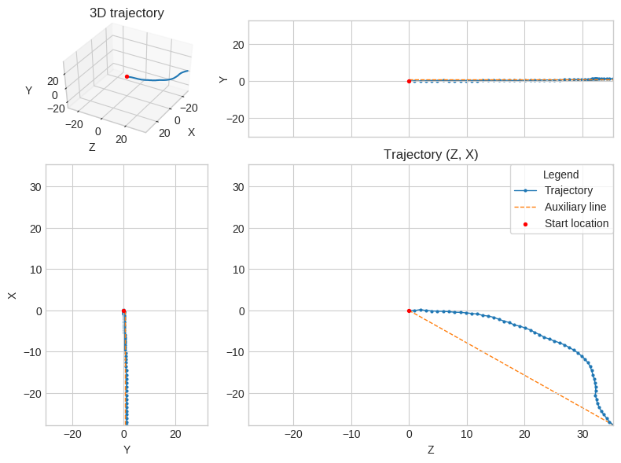

# Visual Odometry for Self-Driving Cars
### This python notebook deals with feature detection of keypoints utilizing monocular vision and estimating the tajectory of the vehicle.

* **Feature Extraction**: Implementing feature exctractor to detect the keypoints, in this project SIFT feature detector has been used.  
* **Feature Matching**: In this particular step, the features detected have been matched from the subsequent frames, to improve the matching, distance thresholding has been used.
* **Trajectory Estimation**: To estimate the trajectory of the vehicles, Essential matrix has been computed and further decomped to extract rotation and translation matrices. Using the above matrices, the trajectory of the vehicle has been computed.

### 1. Feature detection 

Feature Points             |  
:-------------------------:|
  |  

### 2. Feature Matching
Feature Matching           | 
:-------------------------:|
 |

### 3. Trajectory
Trajectory of the vehicle from all Views          | 
:-------------------------:|
 |